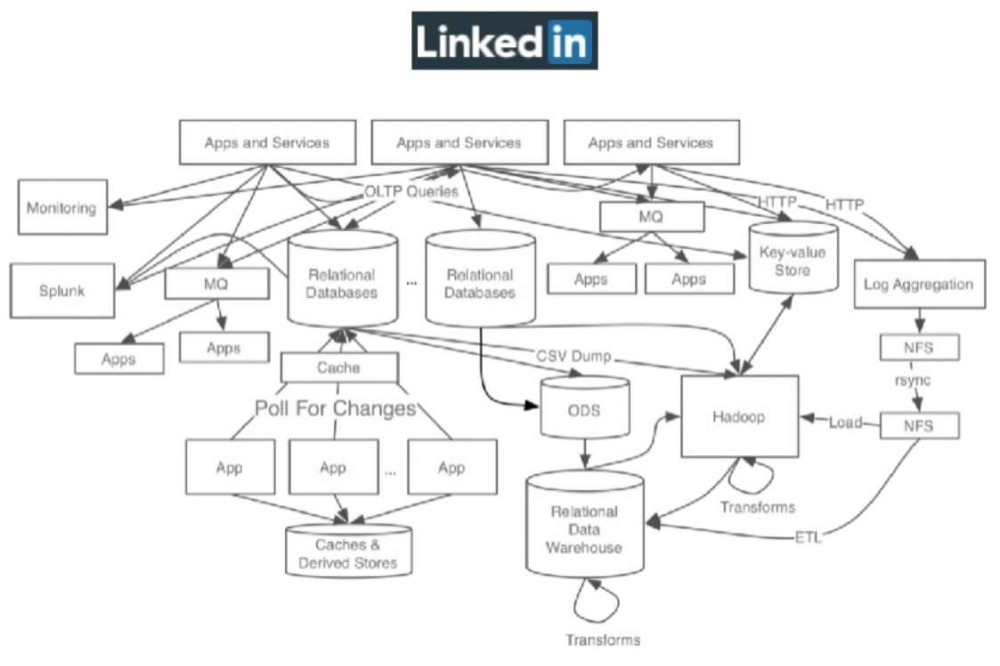
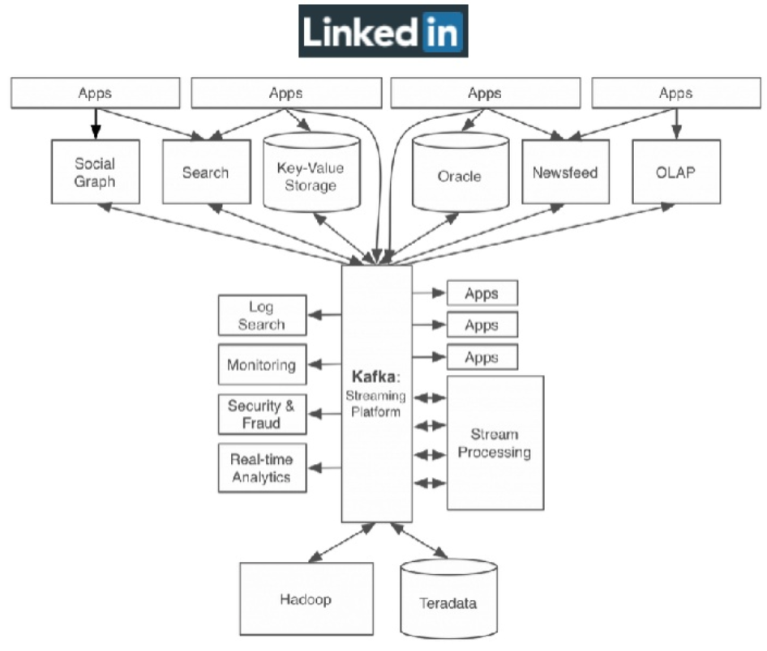

# kafka란?
링크드인 사이트가 급속도로 성장하면서 발생하는 내부 여러 이슈들을 해결하기 위해 탄생하였음



보다시피 각 시스템들이 end-to-end 로 많이 연결되어있다  
급속 성장한 회사들이 정신을 차리고 봤을 떄 마주하게 되는 일반적인(?) 형태인데, 이러한 end-to-end 방식의 아키텍처는 많은 문제점을 가지고있다
- 여기저기서 각 시스템끼리 1:1로 통신하고 있어서 복잡도가 매우 높다
	- 시간이 지날수록 복잡도가 증가할 수 밖에 없다
- consumer 나 producer 가 하나 추가된다고 생각해보면 얼마나 답답할지 각이 나오지 않는가...
	- consumer 의 경우 필요한 데이터를 가져올 곳을 전부 end-to-end 로 연결해야함
	- producer 의 경우 자신의 데이터를 보내줄 곳을 전부 end-to-end 로 연결해야함
- 장애가 났다고 가정해보니, 그것또한 헬이다
	- 어느 전송영역에서 장애가 났는지, 관련된 전송영역을 다 살펴봐야 한다

**중간 계층인 `통합된 전송영역`을 따로 둔다면 위의 문제점을 많이 해결할 수 있지 않을까?**  


- 복잡도가 매우 낮아졌다
- 새로운 producer 가 추가되더라도 카프카에만 데이터를 전송하면 되며, 새로운 consumer 가 추가되더라도 카프카에만 연결하면 된다
	- `모든 시스템에서 사용할 수 있다`라는 카프카의 지향점을 만족한다

## 카프카의 동작 방식과 원리
- 카프카는 기본적으로 메시징 서버로 동작한다
	- 메시지를 보내는 쪽(producer), 메시지가 저장되어 있는 곳(topic), 메시지를 받는 쪽(consumer) 으로 구성된다
- 먼저 Pub/Sub 모델을 알 필요가 있다
	- 발신자가 중앙 메시지 저장소에 메시지를 저장하면 수신자가 이를 가져가는 구조이다
		- 발신자는 수신자를 몰라도 되고, 수신자도 발신자를 몰라도 된다
		- 발신자 - 메시징 시스템 - 수신자
	- 수신자가 큐에서 직접 데이터를 꺼내가므로 데이터 유실의 염려가 없다

- 하지만 기존의 Pub/Sub 모델 구현체들은 이 내부 로직이 복잡하고 부하가 높아서, 대규모 데이터 전송으로는 사용되지 못하고 수 KB 정도의 간단한 이벤트를 전송하는데만 사용되었다
	- 카프카 또한 기존의 Pub/Sub 모델과 동일하지만, 좀 더 특별한 점이 있다!

## 카프카 특징
- 프로듀서와 컨슈머 분리
	- 보내는 역할과 받는 역할을 완벽하게 분리하기를 원했다
	- 프로듀서는 컨슈머를 신경쓰지 않고 카프카에 발행하기만 하면 되고, 컨슈머도 퍼블리셔를 신경쓰지 않고 카프카에서 데이터를 가져오기만 하면 된다
	- 만약 프로듀서와 컨슈머를 1:1로 연결하는 구조였다면, 연결하는 시스템 끼리 다 연결되어야 한다(NxM)
- 멀티 프로듀서, 멀티 컨슈머
	- 중앙 집중형 구조이기 떄문에, 카프카에 N개의 프로듀서가 메시지를 보낼 수 있어야 하고, N개의 컨슈머가 데이터를 가져갈 수 있어야 한다
		- N:M 을 만족하지 않으면 중앙 집중형 구조가 될 수 없다
	- 이를 충족하기 위해선 카프카내에서 데이터를 구분할 수 있는 단위가 있어야하는데, 이를 토픽(topic) 이라고 한다
- 디스크에 메시지 저장
	- 일반적인 메시징 시스템은 컨슈머가 메시지를 읽어가면 바로 삭제하지만, 카프카는 컨슈머가 메시지를 읽어가더라도 바로 삭제하지 않고 일정 주기동안 메시지를 디스크에 저장해놓는다
	- 이러한 특징 떄문에 N 개의 컨슈머가 메시지를 읽어갈 수 있는것이다
		- A 컨슈머가 10~20번까지의 메시지를 읽어가더라도 B 컨슈머가 10~20번까지 메시지를 읽을 수 있다
	- 컨슈머가 수신 불능 상태가 되더라도 카프카에 메시지가 있기 떄문에 메시지가 유실되지 않는다
	- 컨슈머가 프로듀서의 속도를 따라가지 못하더라도 손실없이 메시지를 가져갈 수 있다
- 확장성
	- 카프카 클러스터 내 인스턴스는 3대부터 시작해 수십대로 확장 가능함
	- 서비스 중단없이 가능함
- 높은 성능
	- 고성능 유지를 위해 분산 처리, 배치 처리 등 다양한 기법을 사용하고 있음

- 카프카 용어
	```
	- broker : 카프카 어플리케이션이 설치되어 있는 서버 또는 노드
	- topic : 중앙 집중형 구조이기 떄문에, 메시지를 구분할 단위가 필요함
	- producer : 메시지를 생산하여 브로커의 토픽으로 보내는 어플리케이션
	- consumer : 브로커의 토픽 이름으로 메시지를 가져가는 어플리케이션
	```
