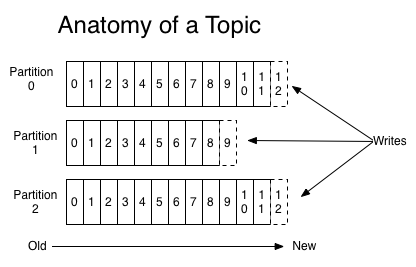

# 카프카 디자인의 특징
## 분산 시스템
- 같은 역할을 하는 여러대의 서버를 네트워크로 묶어서 구성한 시스템을 말한다
  - 단일 시스템보다 높은 성능을 얻을 수 있다(1대가 초당 300 요청을 처리했다면, 2대로 구성하면 초당 600 요청 처리 가능)
  - 위와 같이 확장, 축소가 용이하다(서버만 1대 더 추가하면 된다)
  - 하나의 서버에 장애가 발생해도 다른 서버가 요청을 처리할 수 있다
- 카프카도 분산 시스템이다
  - 카프카 클러스터 내의 브로커 수를 늘리거나 줄일 수 있다

## 페이지 캐시
- 페이지 캐시란 디스크에서 한번 읽은 내용을 저장해놓는 메모리의 특정 영역을 말한다
  - 애플리케이션이 사용하는 부분을 할당하고 남은 잔여 메모리를 페이지 캐시로 사용한다
  - 두번쨰로 읽을때는 직접 디스크에 접근하지 않고 메모리에서 가져올 수 있으므로 속도가 상당히 빠르다
- 카프카는 처리량을 높이기 위해 페이지 캐시를 사용한다

## 배치 전송 처리
- 네트워크 IO 는 비용이 비싸다
- 그래서 카프카는 매번 메시지를 보내지 않고 여러개의 메시지를 묶어서 한번에 보냄으로써 네트워크 오버헤드를 줄이고, 속도를 향상시켰다

# 카프카 데이터 모델
## 토픽
- 메시지가 저장되는 주소
  - n 프로듀서 n 컨슈머의 중앙 메시징 시스템이므로, 메시지를 구분할 단위가 필요하다
  - A 프로듀서와 B 프로듀서가 각각 다른 메시지를 카프카에 보냈는데 주소가 없다면 메시지를 구분할수가 없기 떄문이다
  - e.g. 뉴스 어플리케이션은 news 토픽에 메시지를 보내고, 동영상 어플리케이션은 video 토픽에 메시지를 보낸다
- 브로커내에 존재함
- 토픽 이름은 249자 미만으로 영문, 숫자, `.`, `_`, `-` 를 조합하여 자유롭게 만들 수 있다
  - 카프카 클러스터를 여러 서비스에서 공통으로 사용한다면 각자 형식에 맞춰 토픽 이름을 구분해 주는것이 좋다

## 파티션
- 토픽을 여러개로 분할한 것
  - 리플리케이션이랑은 다르다
- 여러개의 프로듀서가 메시지를 병렬로 전송한다고 하더라도 받는곳이 하나라면 1대의 프로듀서가 메시지를 보내는 것과 성능이 동일하다
  - 메시지 큐의 특성상 메시지를 순서를 보장해야하므로, 이전 메시지 저장이 완료된 후 다음 메시지를 저장해야 하기 때문이다
- 결국 카프카에서 효율적인 메시지 전송과 속도를 높이려면 파티션수를 아래와 같이 늘려줘야 한다
  - 
  - (그림에서는 프로듀서가 하나로 보이지만, 실제로는 프로듀서도 여러개여야 한다)
  - 메시지들이 파티션 각각에 저장되므로 파티션의 개수만큼 속도가 증가하게 된다
    - 물론 파티션의 개수보다 프로듀서의 개수가 많아야 효과가 난다
  - 하지만 메시지의 순서를 보장할 수 없게 된다
    - 3개의 프로듀서가 있다고 할 때, 다음과 같은 상황이 발생할 수 있다
      - 1번 프로듀서 -> 3번 파티션, 2번 프로듀서 -> 2번 파티션, 3번 프로듀서 -> 1번 파티션
      - 읽어올때는 1,2,3번 파티션의 순서대로 읽어오므로(꼭 이 순서는 아닐수 있음) 결국 메시지의 순서가 보장되지 못한다
      - 토픽에 데이터가 저장될 때 컨슈머가 데이터를 바로 읽어오는 것이 아니기 때문에 이와 같은 현상이 발생하는 것이다
      - https://www.popit.kr/kafka-%EC%9A%B4%EC%98%81%EC%9E%90%EA%B0%80-%EB%A7%90%ED%95%98%EB%8A%94-%EC%B2%98%EC%9D%8C-%EC%A0%91%ED%95%98%EB%8A%94-kafka/
    - 데이터의 종류에 따라 다르겠지만, 메시지를 전송할 때 지정하는 `키`의 값을 동일하게 해줌으로써 메시지의 순서가 보장되지 않는 문제점을 해결할 수 있다
      - 메시지가 어느 파티션에 저장될지는 파티션키에 의해 결정되는 특성이 있다(해시 함수와 동일한 구조)
      - 즉 키가 같으면 항상 같은 파티션에 저장되기 때문에, 순서가 무조건 보장되게 된다
      - 특정 엔티티에 해당하는 이벤트가 여러 파티션에 저장된다면, 읽어가는 쪽에서 어떻게 읽어가느냐에 따라 순서에 영향을 받지만, 하나의 파티션에 저장된다면 읽어가는 쪽에서 어떻게 읽어가든 순서에는 문제가 없다

- 파티션 수를 늘리면 속도가 늘어 좋지만, 무조건 파티션 수를 늘리는게 좋은것은 아니다
  - 파일 핸들러의 낭비
    - 파티션은 브로커의 디렉토리에 매핑되므로, 파티션이 늘어날 때 마다 사용하는 파일 핸들러도 많아진다
  - 장애 복구 시간 증가
    - 브로커 컨트롤러가 넘어가는 시간과 파티션 리더를 선출하는 시간이 늘어나게 된다(프로듀서에서 상세히 설명)
  - 이러한 이유로 무작정 파티션을 늘리기 보다는 적절한 값으로 설정해 운영하는 것이 좋다

- 내 토픽의 적절한 파티션 수는?
  - 먼저 프로듀서에서 어느 정도로 메시지를 보내게 되는지 측정해봐야 한다
    - e.g. 4개의 인스턴스에서 초당 메시지가 10개씩 나가므로, 초당 40개의 메시지를 보내게 됨
  - 이후 카프카 클러스터의 파티션 수를 1개만 유지해보고, 초당 40개를 잘 받는지 테스트해본다
    - e.g. 초당 10개밖에 수용하지 못한다면 파티션 개수를 4개로 늘려야 한다
  - 컨슈머도 고려해봐야 한다
    - e.g. 컨슈머 1개가 초당 5개의 메시지를 받을 수 있다면, 8개의 컨슈머가 뜨게 될 것이므로 이에 맞춰 파티션도 8개를 지정하여 컨슈머와 파티션이 1:1 로 접근할 수 있도록 해야한다

- 카프카에서 파티션수의 증가는 아무때나 가능하지만, 파티션 수를 줄이는 방법은 제공하지 않기 떄문에 신중하게 결정해야 한다
  - 파티션수를 측정하기 어려운 경우 일단 적은 수의 파티션으로 운영해보고 병목현상이 발생하게 될 떄 조금씩 파티션을 늘리는 방법을 사용할 수 있다
  - 카프카에서는 브로커당 최대 파티션 2000개를 권장하고 있다

## 오프셋과 메시지 순서
- 파티션마다 메시지가 저장되는 위치를 말한다
- 순차적으로 증가하는 숫자이다
- 파티션마다 유니크한 값을 가지며, 파티션 내에서만 유니크하다
  - 만약 파티션이 4개라고 한다면 오프셋이 0인 데이터는 총 4개가 존재하지만, 파티션 0번에 0번 오프셋 데이터는 유일하다
  - 즉 파티션 내에서는 무조건 순서가 보장된다
  - 하지만 여러 파티션들 사이에서는 메시지의 순서가 보장되지 않는다

# 카프카 리플리케이션
- 카프카는 멀티 브로커에 대해 리플리케이션을 적용할 수 있다
- 리플리케이션은 토픽마다 설정할 수 있다
  - `server.properties`에 `default.replication.factor = 2` 와 같이 작성해 줄 수 있다
  - 토픽 생성 시 `--reflication-factor 2` 와 같이 옵션을 줄 수 있다(주지 않는다면 `server.properties` 의 값을 따라간다)
- 리플리케이션 팩터란 자신을 **복제할 곳의 개수** 를 말한다
  - 3개의 브로커가 있는 상태에서 `topic-name=joont, replication-factor=2` 로 설정했다면, 클러스터내에 joont 토픽의 데이터를 가지고 있는 브로커는 2개가 되는 셈이다
  - replication.factor 의 개수는 전체 브로커의 개수보다 많아질 수 없다
- 리플리케이션 원본을 `리더`라고 부르며, 리플리케이션 복제본을 `팔로워`라고 부른다
  - 리더, 팔로워 브로커는 임의로 정해진다
    - topic 생성시에 broker url 이 아닌 zookeeper url 을 주는 이유이다
  - 모든 읽기와 쓰기는 리더를 통해서만 일어나며, **팔로워는 리더의 데이터를 복제만 하고 읽기와 쓰기에는 관여하지 않는다**
- 리더 브로커에 장애가 발생한다면 리더를 바라보고 있던 팔로워 중 하나가 리더로 승격된다
- 모든 팔로워가 리더로 승격될 수 있는것은 아니고, ISR 이라는 영역내에 있는 팔로워만 리더로 승격될 수 있다
  - ISR 은 가용 상태인 팔로워 목록을 나타낸다
  - 팔로워가 설정된 일정 주기(replica.lag.time.max.ms) 만큼 리더에 복제 요청을 하러 오지 않는다면, 리더는 해당 팔로워에 이상이 있다고 감지하고 해당 팔로워를 ISR 목록에서 제거시킨다
  - ISR 에서 제거된 팔로워는 리더로 승격될 수 있는 자격을 박탈당한다
  - 팔로워가 복구된다면 다시 리더에 복제 요청을 시도하게 될 것이고, 아마도 이때 다시 ISR 목록으로 들어가지 않을까 싶다
- 리플리케이션이 무조건 좋은 것만은 아니다
  - 리플리케이션이 되는 파티션의 개수만큼 저장소의 용량이 더 필요하게 된다
    - e.g. peter 토픽의 사이즈가 100G 고 리플리케이션을 3개로 설정했다면 총 300G 의 용량이 필요하게 된다
  - 팔로워 상태 체크, 리더로부터의 데이터 복제 등 리소스 사용량을 어느정도 증가시키게 된다

- **사실은 브로커가 아니라 파티션이다**
  - 지금까진 리플리케이션을 전부 브로커 레벨에서 설명했지만, 실제로는 파티션 단위로 일어난다
    - 리더, 팔로워 또한 파티션마다 다르다
      ```
      Created topic topic-03.
      Topic: topic-03	PartitionCount: 3	ReplicationFactor: 3	Configs: 
        Topic: topic-03	Partition: 0	Leader: 3	Replicas: 3,1,2Isr: 3,1,2
        Topic: topic-03	Partition: 1	Leader: 1	Replicas: 1,2,3Isr: 1,2,3
        Topic: topic-03	Partition: 2	Leader: 2	Replicas: 2,3,1Isr: 2,3,1
      ```
  - 브로커 안에 토픽이 있고, 토픽안에 파티션이 있고, 이 파티션들이 브로커 단위로 리플리케이션 되는 것이다
    - 
  - 리더의 토픽에 해당하는 파티션이 전부 리플리케이션 될 것이기 때문에, 팔로워들의 파티션 개수는 리더의 파티션 개수와 동일해야 한다
    - 팔로워가 리더의 3번 파티션을 리플리케이션 하려고 하는데, 팔로워에 3번 파티션이 없다면 실패할 것이기 때문이다
    - 하지만 애초에 토픽 생성 + 파티션 생성 명령을 브로커에 하지 않고 zookeeper에 하므로, 이 부분은 크게 문제되지 않는다
      - kafka 생성 시 zookeeper url 을 주기 때문에 zookeeper 는 모든 broker 를 알고있다  

## 모든 브로커가 다운된다면
- 팔로워가 모두 다운되고, 최종적으로 리더까지 다운된 상태를 말한다
- 이 때는 2가지 전략을 사용할 수 있다
  - 리더가 되살아 날 때 까지 기다리는 방법
    - 메시지 손실이 없다(리더가 죽었다면 더 이상 메시지를 받지 못하므로)
    - 많은 브로커 중 꼭 기존의 리더가 살아나야만 서비스를 할 수 있는 방식이므로, 리더가 빠르게 살아나지 못한다면 장애 시간이 길어질 수 있다
  - 가장 빨리 살아난 팔로워를 바로 리더로 승격시키는 방법
    - 리더에 장애가 발생하기 전에 먼저 장애가 발생한 팔로워였기 때문에, 해당 팔로워는 리더의 모든 데이터를 가지고 있지 않은 상태이다(장애났던 시간만큼 리더의 데이터를 복제하지 못했음)
    - 서비스를 빠르게 정상화 시킬 수 있음

- 정답은 없고, 카프카를 운영하는 환경에서 가용성과 일관성 중 어느쪽에 더 초점을 두느냐에 따라 결정해야 한다
- `server.properties`의 `unclean.leader.election.enable` 속성을 통해 어느 전략을 선택할 것인지 결정할 수 있다
  - false 의 경우 마지막 리더를 기다리는 1번 방법이다
  - true 의 경우 팔로워를 바로 리더로 승격시키는 2번 방법이다
