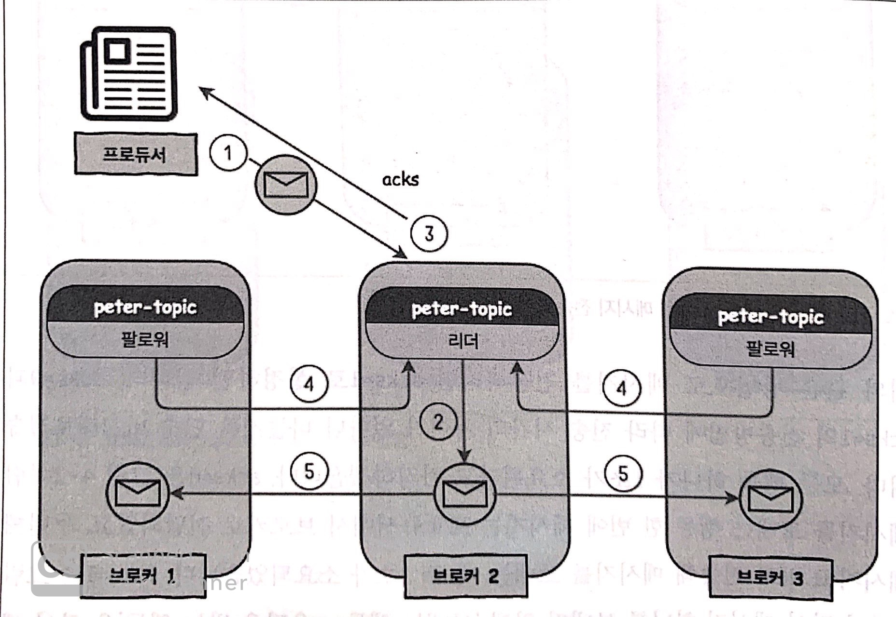

# 프로듀서 주요 옵션

### bootstrap.servers
카프카 클러스터내에 있는 브로커들은 `마스터`라는 개념이 없기 때문에, 클러스터 내 모든 브로커가 클라이언트의 요청을 받을 수 있다  
이 옵션은 카프카에 처음 연결을 하기 위한 호스트의 주소(+포트)를 나타낸다  
단순히 엔드포인트일 뿐이고, 클라이언트가 이곳으로 요청을 보내게되면 내부에서 브로커들끼리 리플리케이션을 하게 되므로 모든 브로커의 주소를 다 입력할 필요는 없다  
하지만 엔드포인트로 쓴 브로커에 장애가 발생할 경우 클러스터에 요청을 전달할 게이트웨이가 막히는 꼴이 되므로, 브로커 리스트를 전체 다 입력하는 것을 권장한다고 한다  
(접속에 장애가 발생할 경우 다른 서버로 재접속을 시도함)  

MSK를 사용할 경우 AZ 에 있는 대표 브로커 주소를 이 속성의 값으로 입력한다  

### acks
프로듀서가 메시지를 보내고 그 메시지를 카프카가 잘 받았는지 확인을 할 것인지 또는 확인을 하지 않을 것인지를 결정하는 옵션이다
이는 아래에서 자세히 설명한다  

- acks=0
  - 메시지를 보내고 서버로부터 응답(ack)을 기다리지 않고 계속해서 메시지를 보내는 방식이다(UDP 처럼)
  - 메시지가 유실될 수 있다
  - 빠르게 메시지를 보낼 수 있다
- acks=1
  - 메시지를 보내고 리더로부터 응답이 오면 다음 메시지를 전송한다
  - 팔로워는 검사하지 않는다
  - 팔로워가 리더의 데이터를 복제하기 전에 리더가 fail 하면 메시지가 유실될 수 있다
- acks=all 또는 acks=-1
  - 리더, 팔로워 모두 다 확인한다
  - 메시지 무손실을 가장 강력하게 보장한다

### buffer.memory
프로듀서가 카프카 서버로 데이터를 보내기 위해 잠시 대기할 수 있는

### compression.type
프로듀서가 데이터를 압축해서 보낼 수 있는데, 어떤 타입으로 압축할 지 정하는 옵션이다  
none, gzip, snappy, lz4 등 다양한 포멧 중 하나를 선택할 수 있다  

### retries
일시적인 오류로 인해 전송에 실패한 데이터를 다시 보내는 횟수  

### batch.size, linger.ms
프로듀서에서 데이터를 배치로 보낼 떄 사용하는 옵션들이다  
- 데이터가 `batch.size` 만큼 쌓이면 카프카로 메시지를 전송한다  
- 만약 `batch.size` 보다 큰 데이터가 들어올 경우 배치를 시도하지 않고 바로 전송한다
- 배치를 보내기 전 프로듀서에 장애가 발생하면 배치로 쌓고있던 메시지는 전달되지 않는다
- `batch.size` 에 도달하지 못하더라도 `linger.ms` 시간만큼 지나면 카프카로 메시지를 전송한다

### buffer.memory
카프카가 일시적인 오류로 메시지를 받지 못할경우 메시지들을 임시로 담아두는 공간이라고 하는데..  

# 메시지 전송 방법
위에서 언급한 `acks` 옵션을 어떻게 사용하느냐에 따라 카프카로 메시지를 전송할 때 메시지 손실 여부와 메시지 전송 속도등이 달라지게 된다  

### 메시지 손실 가능성이 높지만 빠른 전송이 필요한 경우
옵션을 `acks=0` 으로 설정하면 된다  
카프카로부터 응답을 받지 않겠다는 뜻인데,  
이 말인 즉 프로듀서가 카프카에게 메시지를 보내면서 정상 수신을 확인하지 않고 자신의 다음 메시지가 준비되면 계속해서 카프카로 메시지를 전송하는 방식이다(UDP 처럼)  

응답을 받지 않고 계속해서 메시지를 전송하다보니 속도는 가장 빠르지만, 메시지를 정확하게 받았는지 확인하는 플로우가 없으므로 중간에 메시지가 유실될 수 있다  
그렇다고 메시지가 막 엄청나게 유실된다는 소리는 아니고, 장애 상황시에 메시지 손실 가능성이 높은 편이라고 보는것이 좋다  

### 메시지 손실 가능성이 적고 적당한 속도의 전송이 필요한 경우
위의 방법과 달리, 프로듀서가 카프카로 메시지를 보낸 후 카프카가 메시지를 잘 받았는지 응답(acks)을 받아 확인한다  
응답 대기시간이 생기므로 메시지 전송 속도는 위의 방식보다 약간 떨어지게 된다  
이 방식을 사용하려면 옵션을 `acks=1` 로 설정하면 된다  

하지만 이 방법도 100% 메시지 손실을 보장해주는 방법은 아닌데,  
이는 `acks=1` 속성이 응답을 받는 브로커는 리더 1대뿐이기 때문이다  

  

보다시피 **클라이언트에게 ack를 보내는 시점이 팔로워가 리더로부터 데이터를 복제해가는 시점보다 빠르다**  

이러한 특징때문에 아래와 같은 플로우를 통해 데이터가 유실될 수 있다  
1. 메시지를 받은 리더 브로커가 프로듀서에게 ack 를 보냄(3번)
2. 팔로워에서 데이터를 복제해가기 전에 리더에 장애가 발생해서 리더가 다운됨
3. 팔로워 중 하나가 새로운 리더로 승격됨
4. 리더로부터 메시지를 복제하지 못한 상태에서 승격되었으므로 중간 메시지가 유실되었음

하지만 이는 아주 예외적인 경우에 발생하는 현상이므로, 특별한 이유 없으면 `acks=1` 옵션을 설정해서 사용하는 것을 추천한다고 한다  
(logstash, filebeat 등의 프로듀서에도 acks 기본값을 1로 사용하고 있다)  

### 전송 속도는 느리지만 메시지 손실이 없어야 하는 경우
카프카에서는 위의 방식보다 더 강력한 메시지 무손실을 보장할 수 있는 `acks=all(또는 acks=-1)` 을 제공한다  
위처럼 메시지를 보내고 응답을 받은 뒤 다시 메시지를 보내는 방식 자체는 동일한데,  
`acks=1` 의 경우 리더로부터만 응답을 받으면 다음 메시지를 보냈던 반면 `acks=all`의 경우 팔로워까지 응답을 받아야 다음 메시지를 보낼 수 있다  
이로 인해 무손실은 완벽하게 보장되나, 속도는 `acks=1` 보다 더 떨어지게 된다  

이 옵션을 사용할때는 단순히 이 옵션만 설정해선 안되고 브로커의 `min.insync.replicas` 설정도 같이 조정해줘야 한다  
이는 `실제 체크할 브로커의 개수`를 뜻한다고 보면 되는데,  
`acks=all` 이라고 해서 리플리케이션 팩터 개수만큼 acks 를 받는것이 아니라, `min.insync.replicas` 개수만큼만 acks 를 받는다는 뜻이다  

아파치 카프카 문서에서는 손실없는 메시지 전송을 위한 조건으로
- 프로듀서의 acks : all
- 브로커의 min.insync.replicas : 2
- 토픽의 replication factor : 3

을 권장하고 있다  

위 설정을 간단하게 설명하면,  
**토픽은 3개의 브로커에서 리플리케이션이 되고 있지만, 실제로는 2개의 브로커로부터만 ask를 받으면 다음 메시지를 전송한다** 라는 뜻이 된다  

> `min.insync.replicas`의 값을 3으로 설정하지 않는 이유는,  
> replication factor 가 3으로 설정된 상황에서 한개의 브로커에 장애가 발생할 경우  
> 브로커에서 메시지를 받아도 `min.insync.replicas` 의 개수가 충족되지 않기 때문에 프로듀서로 acks 를 보내주지 못하는 상황이 발생하기 떄문이다  
