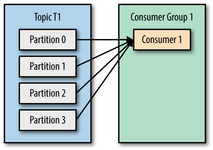
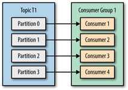
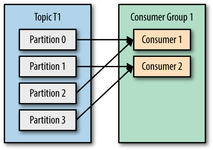
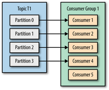

# 컨슈머 동작 방식(간단히)
- `poll()` 메서드는 이전까지 읽어왔던 오프셋 이후의 메시지 전체를 읽어 리턴한다
    - 한번에 메시지를 하나만 가져오는 것이 아니다
    - 그래서 반환형이 `ConsumerRecords` 이다
    - 이를 처리하기 위해 반복문이 필요하다
- **데이터를 읽어오는 시점은 `poll()` 메서드를 호출하는 시점**이다
    - 그러므로 따로 poll 의 주기같은 것이 정해져있지 않고, 속성으로도 존재하지 않는 것이다
- 컨슈머는 카프카에 폴링하는 것을 계속 유지해야 한다
    - 주기적으로 폴링이 들어오지 않으면 컨슈머가 종료된 것으로 판단하고, 컨슈머에 할당된 파티션을 다른 컨슈머에게 할당한다
- `poll()` 메서드의 파라미터로 전달하는 숫자 값은, 컨슈머에 메시지를 폴링했으나 메시지가 없을 경우 다음 폴링을 실행하기까지 기다리는 시간이다
    - 메시지가 있으면 메시지를 읽은 뒤 바로 다음 로직으로 넘어가고, 메시지가 없다면 인자로 전달한 시간만큼 기다린 후 다음 로직을 진행한다

# 컨슈머에 partition 번호 지정
- 파티션이 3개이고, produce 할 때 key 를 지정하지 않고 보냈기 때문에 메시지가 라운드 로빈으로 3개의 파티션에 저장되었다
    ```
    - partition0 : 0 1 2 8
    - partition1 : 3 4 7 9
    - partition2 : 5 6
    ```    
- 파티션을 지정하지 않고 consume 을 수행하면, 모든 파티션을 하나씩 접근한 뒤 메시지를 쭉 읽어온다
    ```
    consumer 결과 : 3 4 7 9 0 1 2 8 5 6
    ```
    - 이는 partition1 -> partition0 -> partition2 의 순서대로 메시지를 읽어온 것이다
- 파티션을 지정했다면 아래와 같이 메시지를 읽어온다
    ```
    consumer1(partition0) 결과 : 0 1 2 8
    consumer2(partition1) 결과 : 3 4 7 9
    consumer3(partition2) 결과 : 5 6
    ```
- 아래의 consumer group 에서 이를 더 편리하게 할 수 있는 방법을 제공한다

# 컨슈머 그룹
- 처음 단순하게 1개의 컨슈머로 시스템을 구성한다면 아래의 그림이 될 것이다
    - 
- 만약 프로듀서가 메시지를 보내는 속도가 컨슈머가 메시지를 consume 하는 속도보다 더 빨라진다면, 컨슈머의 개수를 늘려야만 한다
    - 컨슈머의 개수를 늘린다는건 인스턴스의 개수를 늘리는 것을 말한다
    - 하지만 단순히 인스턴스의 개수를 늘리면, 동일한 메시지를 늘어난 인스턴스 개수만큼 받게되는 문제가 발생한다
        - 인스턴스 각각을 개별 컨슈머라고 생각하기 때문이다(물론 틀린말은 아니지만..)
- 카프카에서는 동일한 토픽에 대해 여러 컨슈머가 메시지를 가져갈 수 있도록 하는 `컨슈머 그룹`이라는 기능을 제공한다
    - 단순하게 말해 여러 인스턴스로 분산된 컨슈머를 하나의 그룹으로 묶는것이다
    - 컨슈머 그룹을 지정하지 않을 경우 인스턴스 각각이 컨슈머 그룹이 된다

- 컨슈머 그룹을 설정한 모습은 아래와 같다
    - 
- 컨슈머끼리 lock 을 잡고 데이터를 가져오는 구조가 아니라, **그룹내에 있는 파티션 1개당 컨슈머 1개가 연결되는 구조**이다
- 컨슈머의 개수가 파티션의 개수보다 적으면 컨슈머가 1개 이상의 파티션으로부터 메시지를 읽어오게 된다
    - 
- 컨슈머의 개수가 파티션의 개수보다 많으면 **남는 컨슈머는 메시지를 컨슘하지 못한다**
    - 
    - 파티션 1개에 컨슈머 1개만 연결될 수 있기 때문이다
        - 위의 예제에서는 이 룰을 벗어나지 않았다
    - 결국 파티션 개수만큼 최대 컨슈머 수가 연결할 수 있다
        - 즉, **프로듀서의 속도가 컨슈머의 속도보다 빠르다고 할 때 무작정 컨슈머의 개수를 늘릴 것이 아니라, 파티션의 개수를 늘리고 그에 맞춰 컨슈머의 개수를 늘려줘야 한다**

- 몇번 파티션에 어떤 컨슈머가 매핑되어 있는지는 zookeeper에 기록된다(?)
    - 새로 들어온 컨슈머가 파티션을 점유하려면, 자기가 쓸 수 있는 파티션이 무엇인지 알아야하기 때문이다
- 컨슈머의 개수가 변동이 있을 경우 계속해서 이 정보가 갱신된다
    - `파티션 : 컨슈머` 매핑을 변경하는 것을 말한다
    - 이를 `리밸런싱`이라고 한다
    - 리밸런스하는 동안에 컨슈머는 일시적으로 메시지를 가져올 수 없다
    - e.g. 파티션 4개, 컨슈머 4개인 상태에서 컨슈머 1개가 다운되면, 컨슈머 1개가 2개의 파티션 메시지를 컨슘하도록 리밸런싱 된다
- 컨슈머는 주기적으로 zookeeper에 하트비트를 보낸다
    - 컨슈머가 살아있다는 신호를 주기적으로 보내주는 것이다
    - zookeeper 입장에서 하트비트를 일정시간 이상 받지 못하면 해당 컨슈머가 죽었다고 판단하고 리밸런싱을 시도하게 된다
    - 컨슈머가 메시지를 poll 하거나 가져간 메시지의 오프셋을 보낼 때 하트비트를 보낸다

- 컨슈머 그룹마다 오프셋을 따로 관리하므로, 추가로 메시지를 컨슘하고 싶을 경우 중복되지 않는 컨슈머 그룹 id 만 설정한 뒤 메시지를 컨슘하면 된다
    - 확장에 매우 용이하다!

# 컨슈머 주요 옵션
#### bootstrap.severs
프로듀서와 동일하다

#### fetch.min.bytes, fetch.max.bytes
한번에 가져올 수 있는 최소/최대 데이터 사이즈이다  
가져올 데이터가 fetch.min.bytes 보다 작을 경우 데이터가 누적될 때 까지 기다린다

#### group.id
컨슈머가 속한 그룹을 식별하는 식별자이다(consumer group)  
지정하지 않을 경우 자동으로 `console-consumer-xxxx`으로 할당된다

#### enable.auto.commit
백그라운드로 주기적으로 오프셋을 커밋한다

#### auto.offset.reset
컨슈머에서 요청한 오프셋이 존재하지 않을 경우 지정한 옵션에 맞게 행동한다
- earliest : 가장 초기의 오프셋으로 설정
- latest : 가장 마지막 오프셋으로 설정
- none : 에러 발생

#### session.timeout.ms
브로커에서 컨슈머가 살아있다고 판단하는 시간이다(기본값 10초)  
브로커에서 이 시간이 지날때까지 컨슈머의 poll 요청(실제 poll + heartbeat)이 오지 않는다면, 브로커는 해당 컨슈머가 종료되었거나 장애가 발생한 것으로 판단하고 컨슈머 그룹의 리밸런스를 시도한다  

이 시간을 짧게 설정하면 컨슈머의 실패를 빨리 감지할 수 있지만, 컨슈머의 로직(가비지 컬렉션, 루프 등) 완료하는 시간이 길어지게 되면 원하지 않게 리밸런스가 일어나기도 한다  
반면에 이 시간을 너무 길게 설정하면 리밸런스가 일어날 가능성은 줄지만, 오류를 감지하는데 오래 걸릴 수 있다  

#### heartbeat.interval.ms
컨슈머는 자신이 정상 동작중이라는 것을 알리기위해 브로커에게 주기적으로 heartbeat 를 보낸다  
heartbeat 는 poll() 메서드를 사용해 보내며, 실제 데이터를 읽어가지는 않는다  
이 값은 `session.timeout.ms` 시간보다 낮아야 한다(일반적으로 1/3 정도로 설정)  

#### max.poll.records
poll 요청에 대한 최대 레코드 수 이다  

#### max.poll.interval.ms
컨슈머가 계속해서 heartbeat 만 보내고 데이터를 가져가지 않는 경우가 있을수도 있다(어떠한 장애로 인하여)  
이러한 경우 컨슈머가 무한정 해당 파티션을 점유할 수 없도록, 지정한 시간만큼 실제 poll 을 요청하지 않으면 장애라고 판단하고 컨슈머 그룹에서 제외한다  

# 커밋과 오프셋
앞서 언급했듯이 컨슈머는 poll() 을 호출할 때 마다 아직 읽지 않은 메시지를 들고오는데, 이는 컨슈머가 자신이 들고간 메시지의 위치를 직접 기록해 놓기 때문이다  
근데 단순히 컨슈머만 오프셋을 알고 있으면 안되는게,  
컨슈머가 장애로 인해 다운되거나 새로 추가되어 컨슈머 리밸런싱이 일어났을 때, 리밸런싱 된 컨슈머는 기존의 파티션과 다른 파티션과 연결되게 될 것이기 때문이다  
기존과 다른 파티션에 연결된 컨슈머는 해당 파티션에서 다음으로 읽어갈 메시지의 오프셋을 알아야하는데, 리밸런싱 된 상태라 그 정보가 없기 때문에 이를 따로 관리해주는 저장소가 필요하게 된다  

올드 카프카 컨슈머(0.9 이전)는 이 정보를 주키퍼에 저장했으나, 성능 등의 문제로 뉴 카프카 컨슈머에서는 카프카 내부에 오프셋용 토픽(__consumer_offset)을 만들고 여기에 오프셋 정보를 저장하고 있다  
> 자동 혹은 수동으로 하는 방법이 있다(아래에서 설명)

이곳에 커밋된 오프셋이 실제로 읽어야 할 오프셋보다 작으면 메시지는 중복으로 처리되고,  
커밋된 오프셋이 실제로 읽어야 할 오프셋보다 크면 메시지는 누락되게 된다  
이렇듯 카프카의 오프셋을 커밋하는 것은 매우 중요하므로, 카프카에서 제공해주는 커밋 옵션을 잘 살펴보고 나에게 맞는 전략을 잘 선택해야 한다  

### 자동 커밋
컨슈머 옵션의 `enable.auto.commit`을 `true`로 설정해주면 5초 주기로 자신이 읽어온 가장 마지막 오프셋을 카프카에 커밋한다  
(주기는 `auto.commit.interval.ms` 옵션으로 조정 가능하다)  

근데 이러한 자동 커밋의 경우, 아래와 같은 문제가 발생할 수 있다  
1. 자동 커밋 주기가 5초인 상태이다
2. 컨슈머가 브로커로부터 메시지를 읽어온 후 3초가 지난 상태이다
3. 이 때 컨슈머에 장애가 발생하여 컨슈머에 리밸런싱이 일어났다
4. 리밸런싱된 컨슈머는 기존의 파티션에서 메시지를 가져와야하는데, 이전 컨슈머가 자신이 읽은 메시지의 오프셋을 커밋하지 않았으므로, 새로운 컨슈머는 이전에 읽었던 메시지를 또 읽게 된다

커밋 주기를 줄여서 이러한 문제점의 발생 가능성을 줄일 순 있지만, 100% 제거하는 것은 불가능하다  
자동 커밋의 경우 편리한 대신 이런 불편함이 있으니, 잘 생각하고 선택해야 한다

### 수동 커밋
말 그대로 커밋을 직접 호출하여 오프셋을 기록하는 방식이다  

```java
public static void main(String[] args) {
    Properties props = new Properties();
    props.put("bootstrap.servers", "peter-kafka001:9092,peter-kafka002:9092,peter-kafka003:9092");
    props.put("group.id", "peter-manual");
    props.put("enable.auto.commit", "false"); // auto commit false
    props.put("key.deserializer", "org.apache.kafka.common.serialization.StringDeserializer");
    props.put("value.deserializer", "org.apache.kafka.common.serialization.StringDeserializer");

    KafkaConsumer<String, String> consumer = new KafkaConsumer<>(props);
    consumer.subscribe(Arrays.asList("peter-topic"));
    
    while (true) {
        ConsumerRecords<String, String> records = consumer.poll(100);
        for (ConsumerRecord<String, String> record : records) {
                insertIntoDB(record); // DB에 값 저장
            try {
                consumer.commitSync(); // 직접 커밋
            } catch (CommitFailedException e) {
                System.out.printf("commit failed", e);
            }
        }
    }
}
```

위처럼 오프셋을 기록하기 전에 통과해야하는 전처리가 있을 경우 사용하기 좋다  

- 일단 consumer 에 커밋하는 부분은 db 트랜잭션과 같이 묶지 않는것이 좋다
    - 트랜잭션 내에 네트워크 통신을 넣으면 전체적으로 트랜잭션이 길어지게 된다(비용이 비쌈)
    - 카프카에 문제가 발생하면 트랜잭션이 반환되지 못하는 상황이 발생한다
- 위처럼 전처리에서 예외가 발생하지 않아야 오프셋을 커밋하는 구조라면, 전처리에서 에러가 발생할 경우 계속해서 다음 메시지로 넘어가지 못하고 중복된 메시지를 읽어오게 된다
- 그렇다고 오프셋을 먼저 커밋하고 후처리 형태로 수행하게 될 경우, 후처리에서 예외 발생 시 메시지가 유실되게 된다

### 특정 오프셋부터 메시지 가져오기
파티션, 오프셋을 지정하여 메시지를 직접 가져올 수도 있다  

```java
TopicPartition partition0 = new TopicPartition(topic, 0);
TopicPartition partition1 = new TopicPartition(topic, 1);

consumer.assign(Arrays.asList(partition0, partition1));
consumer.seek(partition0, offsetNumber);
consumer.seek(partition1, offsetNumber);
```

`seek()` 메서드를 통해 오프셋을 지정해 메시지를 직접 읽어올 수 있다  
하지만 오프셋의 경우 직접 관리하면 매우 번거로워 지므로 자동으로 맡기는 것이 가장 좋다  