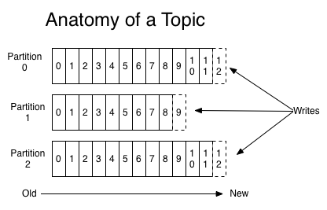

# 카프카 디자인의 특징
## 분산 시스템
- 같은 역할을 하는 여러대의 서버를 네트워크로 묶어서 구성한 시스템을 말한다
  - 단일 시스템보다 높은 성능을 얻을 수 있다(1대가 초당 300 요청을 처리했다면, 2대로 구성하면 초당 600 요청 처리 가능)
  - 위와 같이 확장, 축소가 용이하다(서버만 1대 더 추가하면 된다)
  - 하나의 서버에 장애가 발생해도 다른 서버가 요청을 처리할 수 있다
- 카프카도 분산 시스템이다
  - 카프카 클러스터 내의 브로커 수를 늘리거나 줄일 수 있다

## 페이지 캐시
- 페이지 캐시란 디스크에서 한번 읽은 내용을 저장해놓는 메모리의 특정 영역을 말한다
  - 애플리케이션이 사용하는 부분을 할당하고 남은 잔여 메모리를 페이지 캐시로 사용한다
  - 두번쨰로 읽을때는 직접 디스크에 접근하지 않고 메모리에서 가져올 수 있으므로 속도가 상당히 빠르다
- 카프카는 처리량을 높이기 위해 페이지 캐시를 사용한다

## 배치 전송 처리
- 네트워크 IO 는 비용이 비싸다
- 그래서 카프카는 매번 메시지를 보내지 않고 여러개의 메시지를 묶어서 한번에 보냄으로써 네트워크 오버헤드를 줄이고, 속도를 향상시켰다

# 카프카 데이터 모델
## 토픽
- 메시지가 저장되는 주소
  - n 프로듀서 n 컨슈머의 중앙 메시징 시스템이므로, 메시지를 구분할 단위가 필요하다
  - A 프로듀서와 B 프로듀서가 각각 다른 메시지를 카프카에 보냈는데 주소가 없다면 메시지를 구분할수가 없기 떄문이다
  - e.g. 뉴스 어플리케이션은 news 토픽에 메시지를 보내고, 동영상 어플리케이션은 video 토픽에 메시지를 보낸다
- 브로커내에 존재함
- 토픽 이름은 249자 미만으로 영문, 숫자, `.`, `_`, `-` 를 조합하여 자유롭게 만들 수 있다
  - 카프카 클러스터를 여러 서비스에서 공통으로 사용한다면 각자 형식에 맞춰 토픽 이름을 구분해 주는것이 좋다

## 파티션
- 토픽을 여러개로 분할한 것
- 여러개의 프로듀서가 메시지를 병렬로 전송한다고 하더라도 토픽이 하나라면 1대의 프로듀서가 메시지를 보내는 것과 성능차이가 크지 않을 것이다
  - 메시지 큐의 특성상 메시지를 순서를 보장해야하므로, 이전 메시지 저장이 완료된 후 다음 메시지를 저장해야 하기 때문이다
- 결국 카프카에서 효율적인 메시지 전송과 속도를 높이려면 파티션수를 아래와 같이 늘려줘야 한다
  - 
  - (그림에서는 프로듀서가 하나로 보이지만, 실제로는 프로듀서도 여러개여야 한다)
  - 메시지들이 파티션 각각에 저장되므로 파티션의 개수만큼 속도가 증가하게 된다
    - 물론 파티션의 개수보다 프로듀서의 개수가 많아야 효과가 난다
  - 메시지의 순서를 보장할 수 없게 된다
    - 토픽에 데이터가 저장될 때 컨슈머가 바로 읽어오는 것이 아니라 배치성으로 특정 시점마다 한번에 읽어오는 듯 하다
    - 여기서 파티션의 순서대로 읽어오진 않으므로, 메시지의 순서가 달라질 수 있다(https://www.popit.kr/kafka-%EC%9A%B4%EC%98%81%EC%9E%90%EA%B0%80-%EB%A7%90%ED%95%98%EB%8A%94-%EC%B2%98%EC%9D%8C-%EC%A0%91%ED%95%98%EB%8A%94-kafka/)
    - 같은 파티션 내에서는 메시지의 순서가 보장된다
    - 메시지가 어느 파티션에 저장될지는 파티션키에 의해 결정된다(파티션키를 계산하는 알고리즘이 있다)
    - 그러므로 데이터의 순서가 보장되어야 한다면 파티션키를 잘 설정해야한다(unique 키 등)

- 보다시피 파티션 수를 늘리면 속도가 늘어 좋지만, 무조건 파티션 수를 늘리는게 좋은것은 아니다
  - 파일 핸들러의 낭비
    - 파티션은 브로커의 디렉토리에 매핑되므로, 파티션이 늘어날 떄 마다 사용하는 파일 핸들러도 많아진다
  - 장애 복구 시간 증가
    - 브로커 컨트롤러가 넘어가는 시간과 파티션 리더를 선출하는 시간이 늘어나게 된다(프로듀서에서 상세히 설명)
  - 이러한 이유로 무작정 파티션을 늘리기 보다는 적절한 값으로 설정해 운영하는 것이 좋다

- 내 토픽의 적절한 파티션 수는?
  - 먼저 프로듀서에서 어느 정도로 메시지를 보내게 되는지 측정해봐야 한다
    - e.g. 4개의 인스턴스에서 초당 메시지가 10개씩 나가므로, 초당 40개의 메시지를 보내게 됨
  - 이후 카프카 클러스터의 파티션 수를 1개만 유지해보고, 초당 40개를 잘 받는지 테스트해본다
    - e.g. 초당 10개밖에 수용하지 못한다면 파티션 개수를 4개로 늘려야 한다
  - 컨슈머도 고려해봐야 한다
    - e.g. 컨슈머 1개가 초당 5개의 메시지를 받을 수 있다면, 8개의 컨슈머가 뜨게 될 것이므로 이에 맞춰 파티션도 8개를 지정하여 컨슈머와 파티션이 1:1 로 접근할 수 있도록 해야한다

- 카프카에서 파티션수의 증가는 아무때나 가능하지만, 파티션 수를 줄이는 방법은 제공하지 않기 떄문에 신중하게 결정해야 한다
  - 파티션수를 측정하기 어려운 경우 일단 적은 수의 파티션으로 운영해보고 병목현상이 발생하게 될 떄 조금씩 파티션을 늘리는 방법을 사용할 수 있다
  - 카프카에서는 브로커당 최대 파티션 2000개를 권장하고 있다

## 오프셋과 메시지 순서
- 파티션마다 메시지가 저장되는 위치를 말한다
- 순차적으로 증가하는 숫자이다
- 파티션마다 유니크한 값을 가지며, 파티션 내에서만 유니크하다
  - 만약 파티션이 4개라고 한다면 오프셋이 0인 데이터는 총 4개가 존재하지만, 파티션 0번에 0번 오프셋 데이터는 유일하다
  - 즉 파티션 내에서는 무조건 순서가 보장된다
  - 하지만 여러 파티션들 사이에서는 메시지의 순서가 보장되지 않는다
